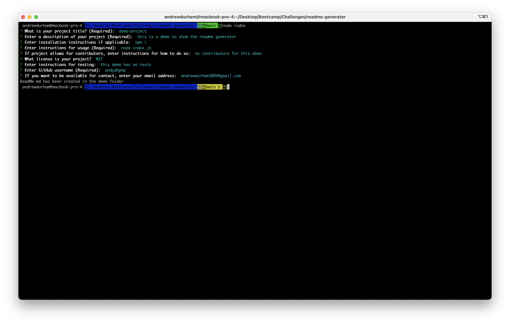

# ReadMe-Generator

## Description

A project built with inquirer that allows a user to answer a series of prompts in order to generate a readme.md
## Demonstration
### Video

https://user-images.githubusercontent.com/62804534/133960402-9b293d0d-1d17-4024-a8b1-27cde7245a80.mov

https://user-images.githubusercontent.com/62804534/133960427-82380dd9-3d54-40e4-8b90-cc343410db84.mov

### Screenshot

## Table of Contents

* [Installation](#installation)
* [Usage](#usage)
* [License](#license)
* [Contributing](#contributing)
* [Tests](#tests)
* [Questions](#questions)

## Installation

To run this application, please do the following installation:

`
npm i
`

## Usage
`
node index.js
`
## License

This application is covered under the MIT license.
## Questions

Link to my GitHub: [andydhpkp](https://github.com/andydhpkp).

Email me for any questions at: [andrewdurham1094@gmail.com](mailto:andrewdurham1094@gmail.com).

